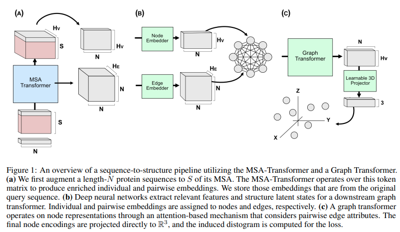

</img>

## Graph Transformer - Pytorch

Implementation of <a href="https://arxiv.org/abs/2009.03509">Graph Transformer</a> in Pytorch, for potential use in replicating <a href="https://github.com/lucidrains/alphafold2">Alphafold2</a>. This was recently used by both <a href="https://www.biorxiv.org/content/10.1101/2021.06.02.446809v1">Costa et al</a> and <a href="https://www.biorxiv.org/content/10.1101/2021.06.14.448402v1">Bakers lab</a> for transforming MSA and pair-wise embedding into 3d coordinates.

## Install

```bash
$ pip install graph-transformer-pytorch
```

## Usage

```python
import torch
from graph_transformer_pytorch import GraphTransformer

model = GraphTransformer(
    dim = 256,
    depth = 6,
    edge_dim = 512,             # optional - if left out, edge dimensions is assumed to be the same as the node dimensions above
    with_feedforwards = True,   # whether to add a feedforward after each attention layer, suggested by literature to be needed
    gated_residual = True,      # to use the gated residual to prevent over-smoothing
    rel_pos_emb = True          # set to True if the nodes are ordered, default to False
)

nodes = torch.randn(1, 128, 256)
edges = torch.randn(1, 128, 128, 512)
mask = torch.ones(1, 128).bool()

nodes, edges = model(nodes, edges, mask = mask)

nodes.shape # (1, 128, 256) - project to R^3 for coordinates
```

If you want it to handle an adjacency matrix

```python
import torch
from graph_transformer_pytorch import GraphTransformer

model = GraphTransformer(
    dim = 256,
    depth = 6,
    edge_dim = 512,
    with_feedforwards = True,
    gated_residual = True,
    rel_pos_emb = True,
    accept_adjacency_matrix = True  # set this to True
)

nodes = torch.randn(2, 128, 256)
adj_mat = torch.randint(0, 2, (2, 128, 128))
mask = torch.ones(2, 128).bool()

nodes, edges = model(nodes, adj_mat = adj_mat, mask = mask)

nodes.shape # (1, 128, 256) - project to R^3 for coordinates
```

## Citations

```bibtex
@article {Costa2021.06.02.446809,
    author  = {Costa, Allan and Ponnapati, Manvitha and Jacobson, Joseph M. and Chatterjee, Pranam},
    title   = {Distillation of MSA Embeddings to Folded Protein Structures with Graph Transformers},
    year    = {2021},
    doi     = {10.1101/2021.06.02.446809},
    publisher = {Cold Spring Harbor Laboratory},
    URL     = {https://www.biorxiv.org/content/early/2021/06/02/2021.06.02.446809},
    eprint  = {https://www.biorxiv.org/content/early/2021/06/02/2021.06.02.446809.full.pdf},
    journal = {bioRxiv}
}
```

```bibtex
@article {Baek2021.06.14.448402,
    author  = {Baek, Minkyung and DiMaio, Frank and Anishchenko, Ivan and Dauparas, Justas and Ovchinnikov, Sergey and Lee, Gyu Rie and Wang, Jue and Cong, Qian and Kinch, Lisa N. and Schaeffer, R. Dustin and Mill{\'a}n, Claudia and Park, Hahnbeom and Adams, Carson and Glassman, Caleb R. and DeGiovanni, Andy and Pereira, Jose H. and Rodrigues, Andria V. and van Dijk, Alberdina A. and Ebrecht, Ana C. and Opperman, Diederik J. and Sagmeister, Theo and Buhlheller, Christoph and Pavkov-Keller, Tea and Rathinaswamy, Manoj K and Dalwadi, Udit and Yip, Calvin K and Burke, John E and Garcia, K. Christopher and Grishin, Nick V. and Adams, Paul D. and Read, Randy J. and Baker, David},
    title   = {Accurate prediction of protein structures and interactions using a 3-track network},
    year    = {2021},
    doi     = {10.1101/2021.06.14.448402},
    publisher = {Cold Spring Harbor Laboratory},
    URL     = {https://www.biorxiv.org/content/early/2021/06/15/2021.06.14.448402},
    eprint  = {https://www.biorxiv.org/content/early/2021/06/15/2021.06.14.448402.full.pdf},
    journal = {bioRxiv}
}
```

```bibtex
@misc{shi2021masked,
    title   = {Masked Label Prediction: Unified Message Passing Model for Semi-Supervised Classification}, 
    author  = {Yunsheng Shi and Zhengjie Huang and Shikun Feng and Hui Zhong and Wenjin Wang and Yu Sun},
    year    = {2021},
    eprint  = {2009.03509},
    archivePrefix = {arXiv},
    primaryClass = {cs.LG}
}
```
